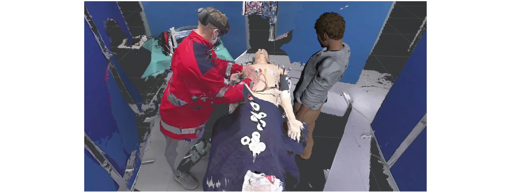

# VVR
This is the code related to the Bachelor Thesis <strong>Deep Learning-based Denoising of Point Clouds Trained on Generated Synthetic Data Simulating Real World Scene Capture Conditions by Azure Kinect</strong>. 

# Motivation
Aiming at creating a reliable telepresence system that can deliver an immersive experience for users to playback a recording inside a VR setting in which they enjoy a free viewpoint view of the entire scene as well as a back and forth playback of the recording, we need to achieve high quality surface reconstructions to make this system viable for real-world use cases. Therefore, building upon the system implemented during my clinical application project, we focus in this work to denoise the captured point clouds from the RGBD camera, since the noise contained in the raw point clouds decreases the reconstructed mesh qualities and poses a problem for downstream tasks.



# Repository Components

The code for this work contains three folders which contain the implementation of:
1. Surface Reconstruction
2. Synthetic Data Generation
3. Mesh Compression and Playback
4. Point Cloud/Mesh Processing (e.g. Smoothing, Denoising, Sampling)

# I. CPP 
This folder contains the implementation of the mesh compression using [Google Draco Compression Library](https://github.com/google/draco). 

# II. Python
This folder contains scripts that do several functions that were need during the point cloud and mesh processing as well as the machine learning models that were trained under different conditions. 
The code for training the models can be found in [Score Denoise](https://github.com/luost26/score-denoise) github repository and the modified scripts can be found under ```src/python/MLTraining```

# III. Unity
This folder contains the implementation for loading and playing back the meshes frame by frame either using the Draco Unity Plugin of C++ DLL.  


The results and datasets can also be find on the INM server under ```scratch/ahmed/score-denoise```